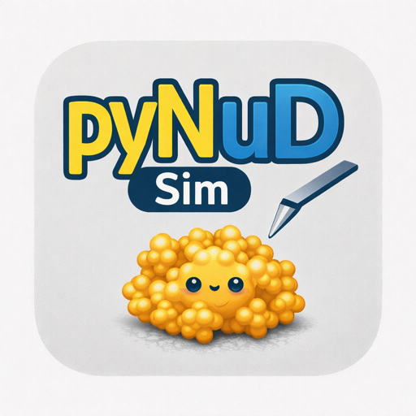
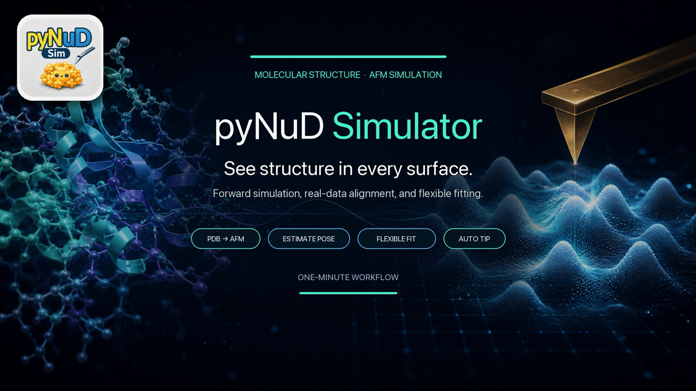

# pyNuD Simulator

**AFM Image Simulator** — simulate AFM images from molecular structures,
align them to experimental data, and run flexible fitting.

**[⬇ Download the latest release](https://github.com/uchihast/pyNuDSim-Installers/releases/latest)**

---

## What it does

pyNuD Simulator is a **standalone** application that generates simulated AFM images
from PDB/mmCIF structures and compares them with experimental AFM data.

- **PDB → AFM** — forward simulation of an AFM image from a structure
- **Estimate Pose** — find the orientation that best matches an experimental image
- **Flexible Fit** — Rigid Domains, Linear ANM, NMFF-AFM, NOLB, Official AFMfit
- **Auto Tip** — tip-shape estimation
- Ribbon and secondary-structure visualization via bundled open-source PyMOL

It is **not** bundled with [pyNuD](https://github.com/uchihast/pyNuD-installer);
install it separately.

## Download

| Platform | Installer | Notes |
| --- | --- | --- |
| macOS (Apple Silicon, arm64) | PKG installer | **Recommended.** Full feature set and real-time operation. |
| Windows (x86_64) | Setup EXE | Stability-first build with some restrictions — see below. |

Both installers are attached to the
**[latest release](https://github.com/uchihast/pyNuDSim-Installers/releases/latest)**.

> [!IMPORTANT]
> A full conda environment including PyMOL is bundled, so both editions need about
> **4 GB of free disk space** and take a few minutes to install.

> [!NOTE]
> The macOS pkg is unsigned and may be blocked the first time you open it.
> If that happens, open **System Settings → Privacy & Security**, find the message
> about this installer near the bottom, and choose **"Open Anyway"** before running it.

### Windows limitations

The Windows build is a stability-first, limited implementation that avoids native
crashes. Compared with the macOS build it:

- skips continuous AFM updates during interaction (updates ~0.35 s after you finish)
- disables the Flexible Fitting live preview
- does not support Nonlinear NMA (NOLB) or Official AFMfit (external)
- may become temporarily unresponsive during long computations

## Live sync with pyNuD

To send the processed AFM frame currently displayed in pyNuD straight to the
Simulator, load the
[`SimulatorBridge.py`](https://github.com/uchihast/pyNuD-plugins/releases/latest/download/SimulatorBridge.py)
plugin in pyNuD:

1. In pyNuD: **Plugin → Load Plugin… → SimulatorBridge.py**
2. In the Simulator: turn on **Live sync from pyNuD**

Simulation and fitting themselves run in the Simulator app.

## Documentation and support

The manual, full release notes and a bilingual (English / Japanese) version of this
page are on the D-Lab software page:

→ **https://dlab-website-2026.vercel.app/software**

Questions and bug reports: `uchihast [at] d.phys.nagoya-u.ac.jp`

## License

[MIT](LICENSE) — developed in the
[Uchihashi Laboratory (D-Lab)](https://dlab-website-2026.vercel.app/),
Department of Physics, Nagoya University.

The bundled PyMOL is the open-source edition; *PyMOL* is a trademark of
Schrödinger, LLC. See the PyMOL and bundled-dependency licenses / third-party
notices for details.
